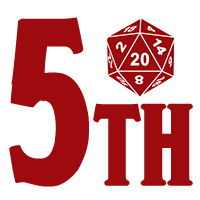
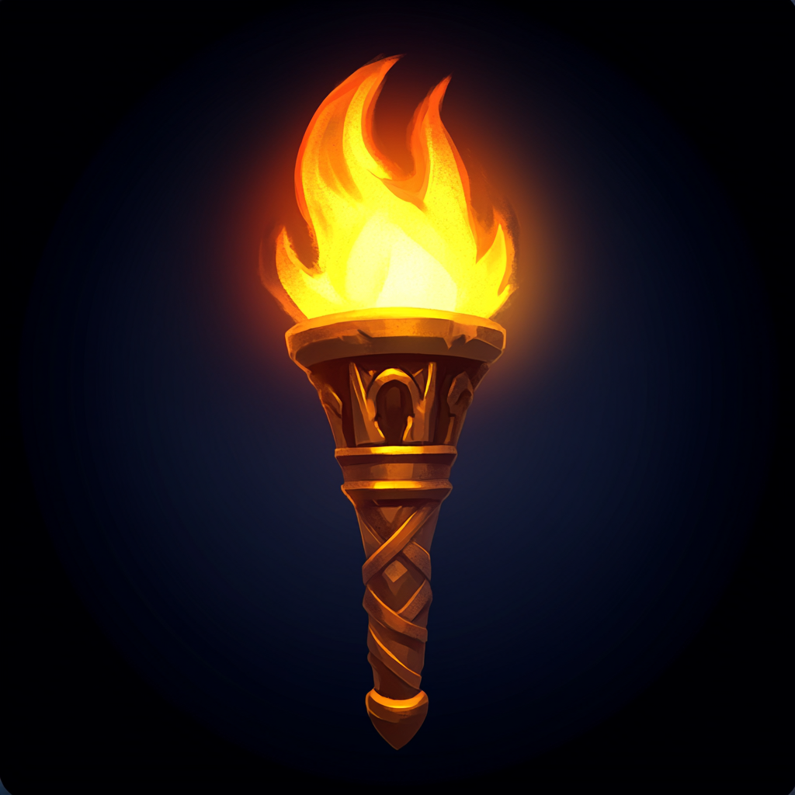

# Let There Be Light 5e - FoundryVTT Module

Let There Be Light 5e FoundryVTT module auto apply vision traits and equipped light source items of any playable 
character to their corresponding token automatically. It only works for DnD5e and 
support Player Handbook 2024 official module as well.

 

# FAQ:

### What if I create a character with darkvision 120 trait ?

Darkvision 120 trait is applied the token directly.

### If I decide to equip a Torch on my character ?

The Torch light stats are applied to your character directly when you equipped it (20ft bright, 20ft dim, Torch animation, etc ...).

### If I decide to equip a Lamp as well ?

You can't have more than one light source equipped, the Lamp will be unequipped.

### What if my Torch doesn't any use left ?

The Torch wont make any light and you will have a notification

### Why Wands and Staffs shine ?

Why not ;P

 

## You want to ask for a change, a fix, release a new version ?

Make a Pull Request explaining your problem and I will do my best

 

## Copyrights

All licensed content, including rules, text, and imagery, belongs to their respective copyright holders. 
This module respects and adheres to the ownership rights of the original creators, including Wizards of the Coast for D&D content.
